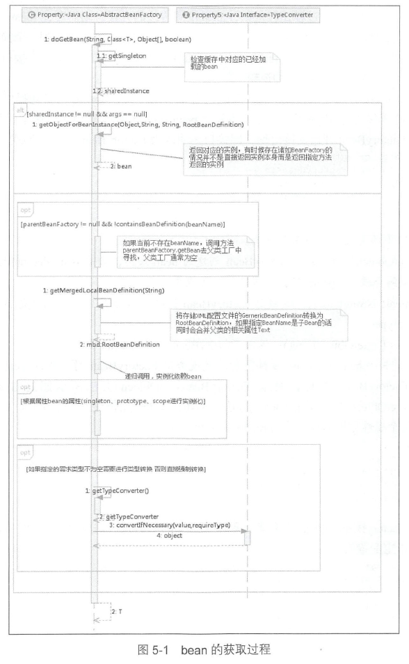

# 5.0 Bean的加载
加载过程的大致步骤： 

1. 转换对应BeanName  

   去除FactoryBean的修饰符，如name=&aa，则转为name=aa；转换alias

2. 尝试从缓存中加载单例  

3. bean的实例化  

   缓存中记录的只是最原始的Bean状态，并不一定是我们想要的Bean；如工厂bean，我们想要的是factory-method中返回的bean，getObjectForBeanInstance就是完成这个工作。

4. 检测parentBeanFactory  

   containsBeanDefinition(beanName)：检测当前加载的xml配置文件是否包含beanName所对应的配置。

5. 将存储xml配置文件的GenericBeanDefinition转换为RootBeanDefinition  

6. 原型模式的依赖检查  

7. 寻找依赖  

   在初始化某一个bean时，首先初始化这个bean所对应的依赖。

8. **针对不同的scope进行bean的创建**  

   默认为singleton。还有其它：prototype，request

9. 类型转换   

